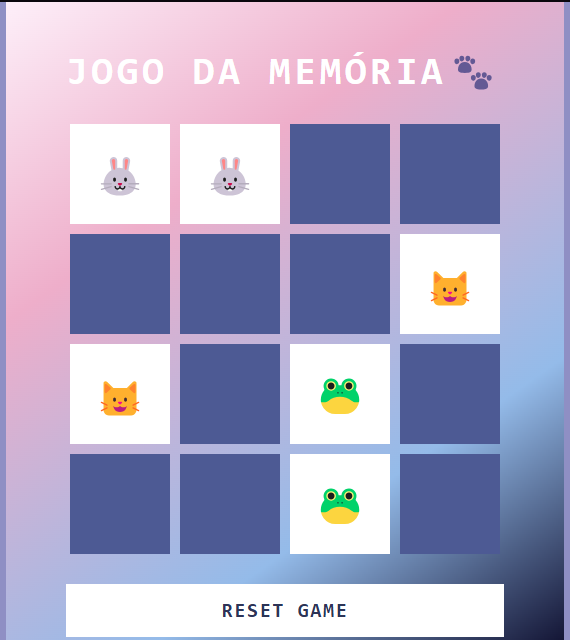

# 🧠 Jogo da Memória com Emojis 🐾

Este é um jogo da memória feito com **HTML, CSS e JavaScript**.

## 🎮 Como jogar
- Clique nas cartas para revelá-las.
- Encontre os pares corretos.
- Quando todos os pares forem encontrados, você vence!

## 🚀 Acesse o Jogo Online
Você pode jogar agora mesmo clicando no link abaixo:

➡️ [**Jogar agora no GitHub Pages**](https://**loohxy**.github.io/**Jogo-da-Memoria**)

## 🔊 Funcionalidades Adicionadas
- Sons ao virar cartas
- Som ao acertar um par
- Som de vitória
- Botão de reset

## 💻 Tecnologias usadas
- HTML
- CSS
- JavaScript puro

## 📸 Imagem do jogo
 

  

---

